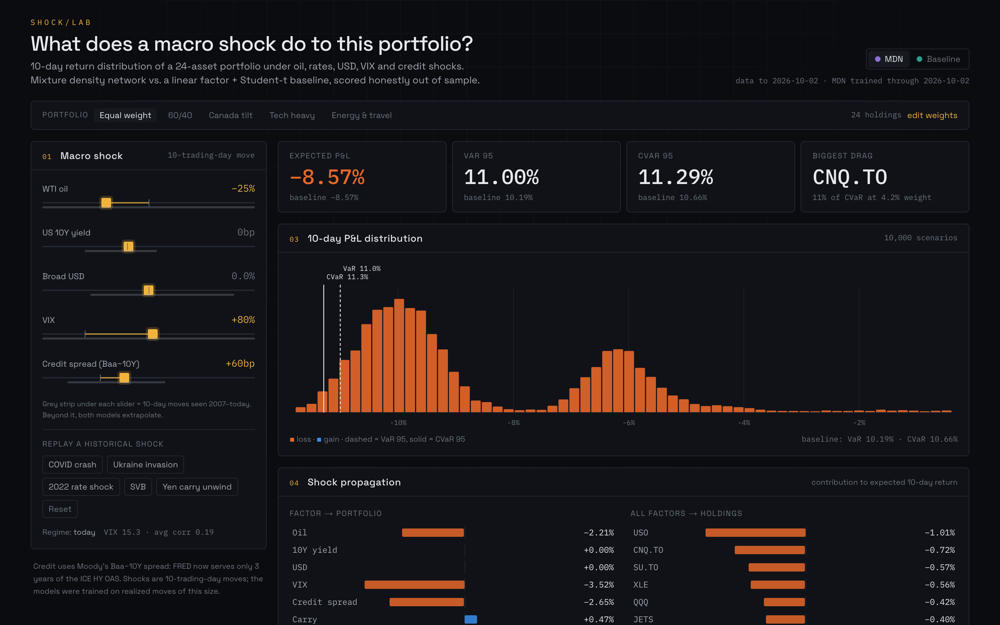
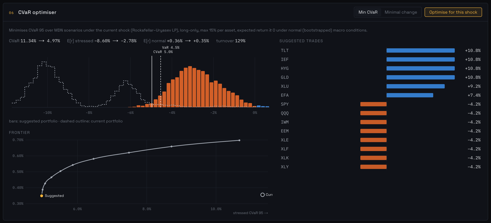
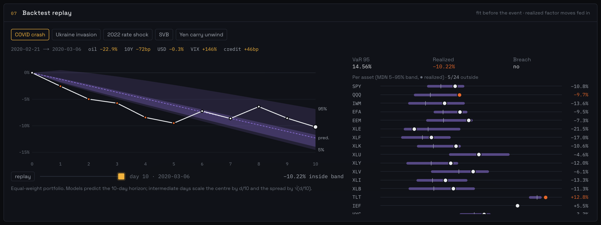
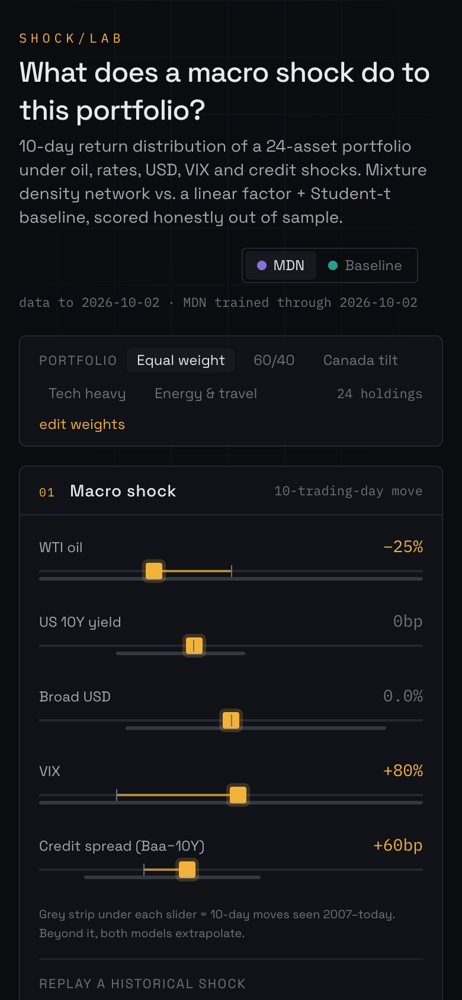
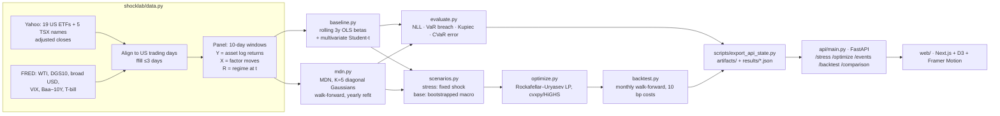

# Shock Lab

Built by [Sherif Morsi](https://github.com/shmorsi) · [Portfolio case study](https://shmorsi.github.io/#shocklab) · [Interactive browser demo](https://shmorsi.github.io/shocklab/)

**Dial in a macro shock (oil, rates, USD, VIX, credit) and see the 10-day return distribution of a 24-asset portfolio, its VaR/CVaR and where the risk comes from, plus the CVaR-minimising hedge. A PyTorch mixture density network is benchmarked against a linear factor + Student-t model, with no lookahead.**

**Live demo: https://shmorsi.github.io/shocklab/** runs entirely in your browser. Both models, the attribution and the CVaR optimiser (HiGHS compiled to WebAssembly) execute client-side, so there is no server and no cold start.

The headline finding is a negative one. **The MDN does not beat the linear baseline out of sample.** It has worse likelihood (−45.2 vs −60.7 mean NLL) and worse likelihood in all 5 stress events. It ties the baseline on portfolio VaR breach rate and has slightly lower point error. Details below.



| Optimiser | Event replay | Phone |
|---|---|---|
|  |  |  |

Full page: [docs/screenshots/desktop-full.png](docs/screenshots/desktop-full.png) · Model honesty panel: [docs/screenshots/honesty.png](docs/screenshots/honesty.png)

---

## Architecture



| Path | What it does |
|---|---|
| `shocklab/data.py` | Download, align, cache (`data/*.parquet`), build 10-day windows |
| `shocklab/baseline.py` | `fit_before(panel, date)`: OLS betas + Student-t residuals; `simulate`, `logpdf` |
| `shocklab/mdn.py` | MDN network, masked NLL, training with early stopping, walk-forward splits |
| `shocklab/risk.py` | VaR, CVaR, component CVaR |
| `shocklab/evaluate.py` | Out-of-sample comparison on non-overlapping windows + events |
| `shocklab/optimize.py` | R-U CVaR LP, minimal-change mode, frontier |
| `shocklab/backtest.py` | Monthly walk-forward backtest vs equal weight, 60/40, min variance |
| `shocklab/stress.py` | Engine behind the API (unit conversion, attribution, histograms) |
| `api/` | FastAPI app + Pydantic schemas |
| `web/` | Dashboard (talks to the API, or runs fully in the browser in static mode) |
| `web/lib/engine.ts` | Browser port of `stress.py`: baseline + MDN forward pass, VaR/CVaR/attribution, R-U LP via HiGHS-wasm |
| `scripts/export_static.py` | Freezes model weights + precomputed results into `web/public/data/` for the static build |
| `tests/` | 28 pytest tests (no-lookahead, determinism, math checks, API contract) |

## How to run

```bash
make setup      # Python 3.11 venv + requirements, npm install in web/
make data       # download + cache prices and factors (≈1 min)
make train      # walk-forward MDNs, MDN vs baseline evaluation, baseline replays (≈3 min on CPU)
make backtest   # monthly backtest 2018→today, then freeze API state (≈2 min)
make test       # pytest + tsc + eslint
make api        # http://localhost:8000  (docs at /docs)
make web        # http://localhost:3000
make static     # browser-only build into web/out (what GitHub Pages serves)
```

`artifacts/` (MDN weights, baseline parameters) and `results/` are committed, so `make api` and `make web` work straight after cloning. `data/` is gitignored. Every random draw is seeded (`SEED = 7`). Rerunning `make train backtest` reproduces the tables below exactly on the same data. Yahoo and FRED do occasionally revise history.

## Method

**Windows.** For each US trading day *t*: `Y[t]` is the 24 assets' log return from close *t* to close *t+10*. `X[t]` is the factor move over the same window: log change for oil, USD and VIX; bp change for the 10Y yield and the credit spread. `R[t]` holds regime features known at *t*: VIX level and the 60-day average pairwise correlation of daily returns. The question both models answer is: *given these factor moves over the next 10 days, what is the distribution of asset returns?*

**No lookahead.** A window counts as known at date *D* only if it **ended** by *D* (`Panel.known_before`), so labels never straddle a split.
- The baseline at date *D* uses windows that start after *D* − 3y and end by *D*.
- The MDN used in year *Y* picks its epoch count by early stopping (train ≤ Dec *Y*−3, validate *Y*−2…*Y*−1). It is then refit on everything up to Dec *Y*−1.
- `mdn_static.pt` is the spec's split: train ≤2017, early-stop on 2018–2019, untouched on 2020+.
- Tests scramble all data after the cutoff and assert that the fitted baseline and MDN weights are bit-identical.

**Evaluation.** Every 10th trading day from 2020-01-01 gives 169 non-overlapping windows. Scored on:
- Joint NLL of the realized 24-vector.
- VaR95 breach rates for each asset and for the equal-weight portfolio, plus a Kupiec test.
- CVaR error: realized loss minus predicted CVaR, on breach windows.

## Results (real, out of sample)

### MDN vs baseline: test period 2020+ (169 non-overlapping 10-day windows)

| Model | Mean NLL ↓ | Asset VaR95 breach (target 5%) | Portfolio VaR95 breach | Kupiec p | Portfolio CVaR error | Portfolio MAE |
|---|---|---|---|---|---|---|
| **Baseline (OLS + t)** | **−60.71** | 7.2% | **6.5%** (11) | **0.389** | +1.13% | 1.35% |
| MDN static (train ≤2017) | −47.55 | 8.1% | 8.3% (14) | 0.072 | **+0.53%** | 1.27% |
| MDN walk-forward | −45.20 | **7.0%** | **6.5%** (11) | **0.389** | +1.41% | **1.22%** |

### Historical events (fit before the event, realized factor moves fed in, equal-weight portfolio)

| Event | Model | NLL ↓ | Asset breaches | Pred. mean | VaR95 | CVaR95 | Realized | Breach |
|---|---|---|---|---|---|---|---|---|
| COVID crash (2020-02-21) | Baseline | **−43.9** | 4/24 | −8.93% | 10.29% | 10.71% | −10.22% | no |
| | MDN static | 12.4 | 1/24 | −11.71% | 14.01% | 14.26% | −10.22% | no |
| | MDN walk-fwd | 47.9 | 2/24 | −12.30% | 14.56% | 14.78% | −10.22% | no |
| Ukraine invasion (2022-02-23) | Baseline | **−40.2** | 0/24 | −2.52% | 5.12% | 6.04% | +2.50% | no |
| | MDN static | −33.7 | 1/24 | −1.29% | 4.09% | 4.75% | +2.50% | no |
| | MDN walk-fwd | −36.5 | 1/24 | −0.97% | 2.78% | 3.33% | +2.50% | no |
| 2022 rate shock (2022-06-03) | Baseline | **−49.4** | 15/24 | −4.18% | 6.83% | 7.78% | −9.63% | **yes** |
| | MDN static | −18.2 | 15/24 | −3.78% | 5.89% | 6.41% | −9.63% | **yes** |
| | MDN walk-fwd | −11.4 | 17/24 | −2.86% | 4.19% | 4.64% | −9.63% | **yes** |
| SVB (2023-03-08) | Baseline | **−49.9** | 6/24 | −0.69% | 3.50% | 4.41% | −3.03% | no |
| | MDN static | −28.5 | 3/24 | −2.68% | 5.08% | 5.46% | −3.03% | no |
| | MDN walk-fwd | −36.8 | 0/24 | −2.94% | 5.57% | 6.26% | −3.03% | no |
| Yen carry unwind (2024-07-31) | Baseline | **−56.2** | 9/24 | +1.73% | 0.58% | 1.24% | −1.72% | **yes** |
| | MDN static | −53.9 | 7/24 | +0.23% | 1.19% | 1.49% | −1.72% | **yes** |
| | MDN walk-fwd | −53.2 | 7/24 | +0.55% | 1.18% | 1.62% | −1.72% | **yes** |

Full CSV: [`results/model_comparison.csv`](results/model_comparison.csv). Per-asset baseline replays: [`results/replay_baseline.txt`](results/replay_baseline.txt).

### Walk-forward backtest (2018-01-02 → 2026-10-02, monthly, 10 bp costs, Sharpe vs 3M T-bill)

| Strategy | CAGR | Volatility | Max drawdown | Worst month | Sharpe | Avg monthly turnover |
|---|---|---|---|---|---|---|
| Equal weight | 11.78% | 15.46% | −34.80% | −16.91% | **0.63** | 3.4% |
| 60/40 SPY/IEF | 9.09% | 11.29% | −21.30% | −7.44% | 0.59 | 1.8% |
| Min variance | 7.69% | 8.32% | −17.99% | −6.36% | 0.61 | 9.6% |
| CVaR (MDN scenarios) | 7.21% | 8.80% | **−17.34%** | −6.51% | 0.53 | 14.6% |
| CVaR (baseline scenarios) | 7.21% | 8.78% | −17.72% | **−5.74%** | 0.53 | 14.6% |

The two CVaR strategies hold different portfolios (daily return correlation 0.95). Their identical CAGR to two decimals is a coincidence.

## Where the model fails

Everything here comes from the tables above.

1. **The MDN loses on the metric it was trained for.** Its out-of-sample NLL is about 15 nats per window worse than the baseline, and worse in all 5 events. The likely cause is structural: each of the 5 components is a *diagonal* Gaussian, so cross-asset correlation must come from mixing components. The baseline has a full 24×24 residual covariance with fat tails. With 2,700–4,900 overlapping (heavily autocorrelated) training windows, the network cannot learn a better joint density than a covariance matrix gives for free. Adding more data didn't help: the walk-forward MDN (−45.2) did *worse* than the static one (−47.6).
2. **The MDN is overconfident in crashes.** In COVID it predicted −12.3% for an equal-weight book that lost −10.2%. Its NLL of +47.9 vs −43.9 means it put almost no probability on what actually happened. The baseline's mean was within 1.3 pts.
3. **Every model breaks when the 5 factors don't describe the shock.**
   - **June 2022:** CPI surprise, then a 75 bp hike. The 10Y moved only +29 bp and VIX +26%, but equities fell about 10%. All three models breached portfolio VaR, and 15–17 of the 24 assets breached their own VaR95. The repricing ran through real yields and the equity risk premium, which these 5 factors only proxy.
   - **Ukraine:** all models predicted a loss, but the book *gained* 2.5% because energy and Canadian producers rallied. CVaR error was −6 to −8.5 pts, i.e. far too conservative.
4. **10-day endpoint shocks hide intra-window spikes.** In the yen carry unwind, VIX went 16.4 → 38.6 (Aug 5) → 16.2. The endpoint-to-endpoint move was −1%, so both models saw "no shock" and all of them breached. The day-by-day replay shows the same problem from the other side: in COVID, the realized path was outside the √t-scaled band on days 1–5 because the losses were front-loaded.
5. **Tails are too thin at the asset level for both models.** Asset VaR95 breach rates are 7.0–8.1% against a 5% target. The baseline's tail losses beyond VaR averaged 1.13 pts worse than its own CVaR.
6. **The MDN extrapolates strangely.** Even for a moderate combined shock (oil −25%, VIX +80%, credit +60 bp, all inside the historical range) it produces a visibly bimodal P&L distribution: two components 4 pts apart, see the hero screenshot. The sliders also allow moves far beyond history: +300 bp in 10 days vs a historical max of +69 bp, and +400 bp credit vs +168 bp. The UI marks these moves as "beyond history". There, the baseline extrapolates linearly and the MDN in ways nobody can vouch for.
7. **CVaR optimisation didn't beat simple minimum variance.** It roughly halved equal weight's drawdown, but Sharpe was 0.53 vs 0.61 for min variance, with 50% more turnover. MDN scenarios didn't beat baseline scenarios inside the optimiser either.

## Data caveats (decisions I'd defend)

- **Credit factor = Moody's Baa−10Y (`BAA10Y`), not ICE HY OAS.** FRED now serves only the last 3 years of `BAMLH0A0HYM2`, which would leave no training history. Baa−10Y is investment grade, so its moves are smaller than HY's.
- **WTI printed −$37.63 on 2020-04-20.** Log changes need positive prices, so non-positive prints are treated as missing and forward-filled.
- **TSX names are in CAD** and not converted to USD (the backtest notes this). On Canadian holidays they are forward-filled (zero return).
- **Shorter histories are masked.** JETS starts 2015-04 and HYG 2007-04. For the MDN, a missing asset drops out of the likelihood, which for a diagonal mixture is exactly marginalisation. The baseline drops any asset with <95% coverage in its window.
- **Overlapping windows are used for fitting** (consistent point estimates, more data) **but never for scoring.**
- The optimiser's 10-day CVaR objective is held for a month in the backtest, a horizon mismatch.

## Deploying

**Static site → GitHub Pages (no server).** `.github/workflows/pages.yml` builds `web/` with `NEXT_PUBLIC_STATIC=1` on every push to `main`. In that mode the dashboard loads `web/public/data/engine.json` (0.7 MB: baseline α/β/Cholesky/ν, MDN weights and scalers, regime, historical factor moves) and runs the models in JavaScript. Random draws use a seeded JS generator, so numbers match the Python API statistically (e.g. MDN VaR 11.00% vs 11.00%, CVaR 11.31% vs 11.29%), not digit for digit. The optimiser uses 1,500 scenarios in the browser vs 4,000 in the API.

**API → Render (Docker).** `render.yaml` is a blueprint. Create a new Blueprint from the repo, or a Web Service with runtime *Docker*. Set `CORS_ORIGINS=https://<your-app>.vercel.app`. The image installs CPU-only torch and serves the committed `artifacts/` and `results/`, so no data download happens at runtime. Health check: `/health`. Free instances sleep, so the first request takes about 30 s.

```bash
docker build -t shocklab-api .
docker run -p 8000:8000 -e CORS_ORIGINS=http://localhost:3000 shocklab-api
```

**Web → Vercel.** Import the repo, set **Root Directory = `web`**, framework Next.js. Add env var `NEXT_PUBLIC_API_URL=https://<your-render-service>.onrender.com`. The page is static and all data comes from the API.

To refresh numbers: `make data train backtest`, commit `artifacts/` + `results/`, and redeploy both.

---
*Research project, not investment advice.*
